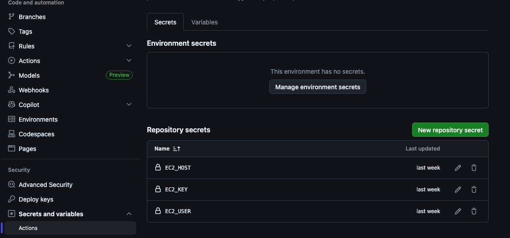

# AWS EC2 CI/CD for a Python App (Port 8000)

A clean, step‑by‑step walkthrough of how I set up CI/CD to an EC2 instance, wired up `systemd`, stored keys in GitHub Secrets, and opened port `8000`. Minimal, practical, and a little fun approach.

## What’s in This Repo
- `app.py` — tiny Python app (example service to deploy)
- `test_myapp.py` — pytest tests
- `requirements.txt` — dependencies
- `screenshots/` — visual checkpoints

## Prereqs
- AWS account with EC2 access
- A Linux EC2 instance (Amazon Linux in this guide)
- A GitHub repo for this project
- The `.pem` key downloaded from the EC2 creation page

---

## 1) Create the EC2 Instance
1. Launch an EC2 instance (Amazon Linux in this guide).
1. Create or select a key pair for SSH and download the `.pem` file (you’ll need it locally).
1. Note the **public IPv4 address** and **username** (often `ec2-user`).

---

## 2) Open Port 8000 in the Security Group
Your app listens on port `8000`, so we must allow it.

1. In the EC2 console, open **Security Groups** for the instance.
1. Add an **Inbound rule**:
   - Type: `Custom TCP`
   - Port: `8000`
   - Source: `0.0.0.0/0` (or your IP for stricter access)

---

## 3) SSH Into the Instance + Install System Packages
From your local machine (use the `.pem` you downloaded):

```bash
chmod 400 /path/to/your-key.pem
ssh -i /path/to/your-key.pem ec2-user@<EC2_PUBLIC_IP>
```

On the server , update packages, install python3, pip, and git:

```bash
sudo dnf update -y
sudo dnf install -y python3 python3-pip git
python3 -m ensurepip --upgrade
```

---

## 4) Clone the Repo and Install Dependencies
```bash
git clone <YOUR_REPO_URL>
cd ci_cd_example
python3 -m venv .venv
source .venv/bin/activate
pip install -r requirements.txt
```

Test it quickly:

```bash
python app.py
```

If it runs, stop it with `Ctrl+C`. Or `lsof -i :8000` and `kill -9 <PID>`

---

## 5) Create a `systemd` Service
We’ll run the app as a service so it survives reboots.

Create the service file:

```bash
sudo nano /etc/systemd/system/ci_cd_example.service
```

Example service file:

```ini
[Unit]
Description=My Python App on Port 8000
After=network.target

[Service]
User=ec2-user
WorkingDirectory=/home/ec2-user/ci_cd_example
Environment="PATH=/home/ec2-user/ci_cd_example/.venv/bin"
ExecStart=/home/ec2-user/ci_cd_example/.venv/bin/python app.py
Restart=always
RestartSec=3

[Install]
WantedBy=multi-user.target
```

Enable and start:

```bash
sudo systemctl daemon-reload
sudo systemctl enable ci_cd_example
sudo systemctl start ci_cd_example
sudo systemctl status ci_cd_example
```

Check it’s live:

```bash
curl http://<EC2_PUBLIC_IP>:8000
```

---

## 6) Add GitHub Secrets
Go to your repo → **Settings → Secrets and variables → Actions**.

Add these secrets:
- `EC2_HOST` — public IPv4 of your EC2
- `EC2_USER` — usually `ec2-user`
- `EC2_SSH_KEY` — the **private** SSH key (paste full contents of the .pem)
- `EC2_PORT` — optional if you use non‑default SSH port (usually `22`)


---

## 7) GitHub Actions Workflow (CI + CD)
Here’s a simple workflow that runs tests with **pytest** and deploys via **appleboy/ssh-action**.

```yaml
name: CI/CD

on:
  push:
    branches: [ "main" ]

jobs:
  test-and-deploy:
    runs-on: ubuntu-latest

    steps:
      - name: Checkout
        uses: actions/checkout@v4

      - name: Set up Python
        uses: actions/setup-python@v5
        with:
          python-version: "3.11"

      - name: Install deps
        run: |
          python -m pip install --upgrade pip
          pip install -r requirements.txt

      - name: Run tests
        run: pytest -q

      - name: Deploy to EC2
        uses: appleboy/ssh-action@v1.0.3
        with:
          host: ${{ secrets.EC2_HOST }}
          username: ${{ secrets.EC2_USER }}
          key: ${{ secrets.EC2_SSH_KEY }}
          script: |
            cd /home/ec2-user/ci_cd_example
            git pull origin main
            source .venv/bin/activate
            pip install -r requirements.txt
            sudo systemctl restart ci_cd_example
```

### Why `pytest`?
- Runs your test suite on every push to `main`.
- Blocks deployment if tests fail (good guardrail), which I will explain with an example later.

### Why `appleboy/ssh-action`?
- It opens an SSH session from the GitHub runner to your EC2.
- Lets you run deployment commands on the server (pull code, install deps, restart service).
- Keeps the workflow minimal and readable.

---

## Screenshots
These capture key checkpoints from the setup. Logining into the AWS EC2 via SSH:


Cloning the repository:


Running the WSGI HTTP server:

Successful build on GitHub Actions , triggered when there is a push :


---

- Verify if the deployment was actually successful by accessing the URL : EC2_PUBLIC_IP:8000
---

## Tiny Improvements I’d Consider Next Time
- Add a **health check endpoint** and have the workflow verify it after deploy.
- Use **GitHub Environments** for protected deploys (manual approval to prod).s
- Add **log rotation** or a centralized logging tool (CloudWatch is easy wins).

---

## Optional Guard: Deploy Only If Tests Pass
Add an `id` to the test step, then gate the deploy with `steps.<id>.outcome == 'success'`.

```yaml
- name: Run tests
  id: tests
  run: pytest -q

- name: Deploy to EC2
  if: ${{ steps.tests.outcome == 'success' }}
  uses: appleboy/ssh-action@v1.0.3
  with:
    host: ${{ secrets.EC2_HOST }}
    username: ${{ secrets.EC2_USER }}
    key: ${{ secrets.EC2_SSH_KEY }}
    script: |
      cd /home/ec2-user/ci_cd_example
      git pull origin main
      source .venv/bin/activate
      pip install -r requirements.txt
      sudo systemctl restart ci_cd_example
```

---

## Quick Troubleshooting
- **Port 8000 blocked**: check Security Group inbound rules.
- **Service not starting**: run `sudo systemctl status ci_cd_example` and `journalctl -u ci_cd_example -e`.
- **GitHub deploy fails**: verify `EC2_SSH_KEY` is correct and that the public key exists in `authorized_keys`.

---

Enjoy! Connect with me on LinkedIn, let me know if you have any suggestions. 😃
